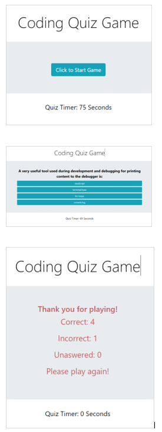

# Code Quiz 

***JavaScript / JQuery Application by Diane Candler***
<hr>

<<<<<<< HEAD
### Beat the clock!  
=======
### Beat the clock!  :alarm_clock:
>>>>>>> d2b0ca317bf2a9db00ef7f197990ff73bc8dbadd
*This quiz prompts players to answer questions before the game timer runs out.*

## About this Application 
 
 ```
 * Designed as a simple coding refresher game.
 * This JavaScript application uses JQuery...evidence by the $.
 * Runs in the browser and features dynamically updated HTML and CSS powered by JavaScript code.
 * Each multiple choice question returns  indication of correct or incorrect answers.
 * Incorrect answers display the correct answer.  Timer is set to delay moving to the next question to ensure time for the gamer to reflect.
 * Plans to add more questions and the ability to leave gamer's name then dynamically list highest scores.
 ```
:question: :question: :question: :question: :question: :question: :question: :question: :question:


<<<<<<< HEAD


### Thank you so much!

***Your time is valuable. Thank you for taking time to review this program. Feedback is welcome at dianedcandler@gmail.com.***


### View my Portfolio for more Applications
=======


### Thank you

***Your time is valuable. Thank you for taking time to review this program.***

Feedback is welcome at dianeDcandler@gmail.com


### View my Portfolio for more Applications

>>>>>>> d2b0ca317bf2a9db00ef7f197990ff73bc8dbadd
**[https://dianecandler.herokuapp.com/](https://dianecandler.herokuapp.com/)**

- - -
© 2020 Diane Candler. All Rights Reserved.
